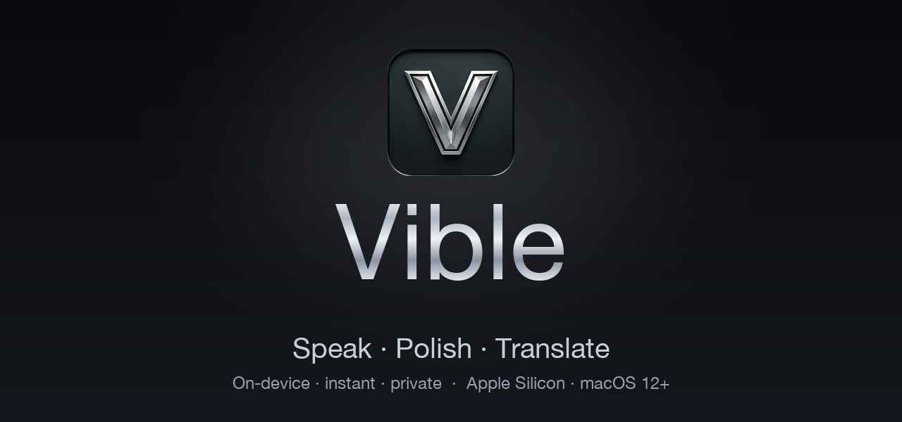

# Vible — Your voice, polished into perfect text

**Speak. Polish. Translate.** On-device, instant, and private — a complete voice layer for your Mac.

 

[-C7CED9?style=for-the-badge&labelColor=0A0B0E)](https://github.com/Algohash-inc/Vible/releases/latest/download/Vible.dmg)

[**Website**](https://vible.space) · [**Download**](https://github.com/Algohash-inc/Vible/releases/latest/download/Vible.dmg) · [**Setup guide**](#-install) · [**FAQ**](#-faq)

Vible turns your voice into clean, corrected, translated text **in any app** — at the speed of thought. Local models give you speed and privacy on Apple Silicon; flip one switch for cloud GPU power when you want it. Hold a hotkey, talk, release — Vible transcribes, fixes your grammar, translates, and can even speak it back.

---

## ✨ Highlights

- ⚡ **At the speed of thought** — Hold `⌃⌘`, speak, release. Local Whisper transcribes instantly and the polished text pastes straight into whatever app you're in.
- 🧹 **Automatic grammar polish** — Every transcript is cleaned before it lands: punctuation, casing, and filler words ("um", "uh", "like") gone.
- 🌍 **Live translation, 20+ languages** — Speak one language, type another. Two-way conversation mode for real-time back-and-forth.
- ⌘ **Translate anywhere with double-tap ⌘C** — Select text in any app, tap `⌘C` twice, and a popup translates it in place — copy, speak, or replace your selection.
- 🗣️ **Natural text-to-speech + voice clone** — Read anything aloud in studio-grade voices, or record 30 seconds and have Vible read back in *your own* voice.
- 🪶 **On-device by default** — Local **MLX + ONNX** models run on Apple Silicon. Fast, offline-capable, and private — your audio never has to leave your Mac.
- ☁️ **Cloud when you want it** — One switch enables GPU-backed models: no downloads, no warm-up, richer neural voices.
- 🔒 **Private & encrypted** — Nothing is uploaded unless you turn cloud on. On-device and in-transit data are encrypted; your voice and text are never sold, shared, or used for training.
- 🍎 **Signed & notarized** — Built for Apple Silicon, signed by **Algohash Inc.** and notarized by Apple — opens with no security warning.

---

## 🎙️ The voice loop — one hotkey, four superpowers

Hold the key, talk, release. That's the whole interaction.

| | Step | What happens |
|---|---|---|
| 1 | **Capture** | Hold `⌃⌘` anywhere and speak — a live waveform shows it listening. |
| 2 | **Transcribe** | Local Whisper turns speech into raw text instantly, on-device. |
| 3 | **Polish** | Grammar, casing, and filler words are cleaned in a single pass. |
| 4 | **Translate / Speak** | Optionally translate, then auto-paste into your app — or read it aloud. |

> You speak ~3× faster than you type. Vible makes that speed usable in every text field on your Mac.

---

## ⌘ Translate anything, right where you are

No window to open, nothing to paste:

1. **Select** any text in any app — Mail, Slack, a PDF, the browser.
2. **Double-tap `⌘C`** — fast. Vible catches the copy and a popup springs up right at your cursor.
3. **Pick language & tone** — source is auto-detected; choose your target language and tone (*formal*, *natural*, or *with pronunciation*), then **Copy**, **Speak** it aloud, or **Replace** it over your selection in place.

`20+ languages` · `Formal / natural` · `Replace in place`

---

## 🗣️ Three ways to be heard

| Voice | Tier | Description |
|---|---|---|
| **Standard** | On-device · free | Crisp local TTS that runs offline on Apple Silicon — instant, private reads. |
| **Premium** | Cloud GPU | Studio-grade neural voices with emotion across 20+ languages, streamed from the cloud. |
| **Zero-shot Voice Clone** | Studio | Record 30 seconds and Vible reads anything back in *your own* voice. |

---

## 🔒 Private by default

Vible runs **all-in-local** — speech-to-text and text-to-speech execute entirely on Apple Silicon via **MLX & ONNX**. No internet, no servers, nothing to leak — private even with Wi-Fi off.

- ✅ Works fully offline
- ✅ Nothing uploaded — ever (unless you enable cloud)
- ✅ Encrypted on-device **and** in transit (TLS)

Need maximum throughput and the richest neural voices? Flip one switch for **GPU cloud** — instant synthesis, no warm-up. Either way, your data is encrypted and never used for training.

---

## 📊 Typing is slow. Vible isn't.

| Capability | Typing | Generic dictation | **Vible** |
|---|:---:|:---:|:---:|
| Raw input speed | ~40 wpm | ~120 wpm | **~150 wpm** |
| Auto grammar & punctuation | manual | — | **✓** |
| Inline translation | — | — | **✓ 20+ langs** |
| Works in every app | ✓ | some | **✓ system-wide** |
| Runs offline / on-device | ✓ | cloud-only | **✓ + cloud** |
| Speaks results back (TTS) | — | — | **✓ + voice clone** |

---

## 🌍 Languages

**Interface (8):** English · 繁體中文 · 简体中文 · 日本語 · 한국어 · Español · Français · Deutsch

**Translation & voice:** 20+ languages, with a two-way conversation mode.

---

## 🚀 Install

> [**⬇ Download Vible.dmg**](https://github.com/Algohash-inc/Vible/releases/latest/download/Vible.dmg) — then follow the steps in your language below.

<b>English</b>

1. **Download** [`Vible.dmg`](https://github.com/Algohash-inc/Vible/releases/latest/download/Vible.dmg).
2. **Open** the downloaded `Vible.dmg` (double-click it).
3. **Drag** the **Vible** icon onto the **Applications** folder in the window that appears.
4. **Launch** Vible from Applications or Launchpad. It's signed and notarized by Apple, so it opens with **no security warning**.
5. **Grant the mic** — allow microphone + input monitoring once. Nothing leaves your Mac unless you turn cloud on.
6. **Hold `⌃⌘` and talk** — release, and the polished text pastes right where your cursor is. On first launch, Vible sets up its on-device models — give it a moment.

<b>繁體中文</b>

1. **下載** [`Vible.dmg`](https://github.com/Algohash-inc/Vible/releases/latest/download/Vible.dmg)。
2. **打開** 下載好的 `Vible.dmg`（雙擊它）。
3. 在彈出的視窗中，把 **Vible** 圖示**拖曳**到 **Applications（應用程式）**資料夾。
4. 從「應用程式」或 Launchpad **啟動** Vible。它已由 Apple 簽署並公證，因此開啟時**不會有任何安全警告**。
5. **授予麥克風權限** — 允許「麥克風」與「輸入監控」一次。除非你開啟雲端，否則資料不會離開你的 Mac。
6. **按住 `⌃⌘` 說話** — 放開後，整理好的文字會貼到游標所在處。首次啟動時，Vible 會設定本機模型，請稍候片刻。

<b>简体中文</b>

1. **下载** [`Vible.dmg`](https://github.com/Algohash-inc/Vible/releases/latest/download/Vible.dmg)。
2. **打开** 下载好的 `Vible.dmg`（双击它）。
3. 在弹出的窗口中，把 **Vible** 图标**拖到** **Applications（应用程序）**文件夹。
4. 从「应用程序」或 Launchpad **启动** Vible。它已由 Apple 签名并公证，因此打开时**不会出现任何安全警告**。
5. **授予麦克风权限** — 允许「麦克风」与「输入监控」一次。除非你开启云端，否则数据不会离开你的 Mac。
6. **按住 `⌃⌘` 说话** — 松开后，整理好的文字会粘贴到光标所在处。首次启动时，Vible 会设置本地模型，请稍候片刻。

<b>日本語</b>

1. [`Vible.dmg`](https://github.com/Algohash-inc/Vible/releases/latest/download/Vible.dmg) を **ダウンロード** します。
2. ダウンロードした `Vible.dmg` を **開きます**（ダブルクリック）。
3. 表示されたウインドウで、**Vible** アイコンを **「アプリケーション」フォルダ** に **ドラッグ** します。
4. 「アプリケーション」または Launchpad から Vible を **起動** します。Apple の署名・公証済みなので、**警告なしで** 開きます。
5. **マイクを許可** — 「マイク」と「入力監視」を一度だけ許可します。クラウドを有効にしない限り、データが Mac の外に出ることはありません。
6. **`⌃⌘` を押しながら話す** — 離すと、整えられたテキストがカーソル位置に貼り付けられます。初回起動時、Vible は端末内モデルを設定します。少しお待ちください。

<b>한국어</b>

1. [`Vible.dmg`](https://github.com/Algohash-inc/Vible/releases/latest/download/Vible.dmg) 를 **다운로드**합니다.
2. 다운로드한 `Vible.dmg` 를 **엽니다**(더블 클릭).
3. 나타나는 창에서 **Vible** 아이콘을 **응용 프로그램(Applications)** 폴더로 **드래그**합니다.
4. 응용 프로그램 또는 Launchpad에서 Vible 을 **실행**합니다. Apple의 서명·공증을 받았으므로 **보안 경고 없이** 열립니다.
5. **마이크 권한 허용** — '마이크'와 '입력 모니터링'을 한 번 허용합니다. 클라우드를 켜지 않는 한 데이터가 Mac을 떠나지 않습니다.
6. **`⌃⌘` 를 누른 채 말하기** — 손을 떼면 다듬어진 텍스트가 커서 위치에 붙여넣어집니다. 처음 실행 시 Vible 은 온디바이스 모델을 설정합니다. 잠시 기다려 주세요.

<b>Español</b>

1. **Descarga** [`Vible.dmg`](https://github.com/Algohash-inc/Vible/releases/latest/download/Vible.dmg).
2. **Abre** el `Vible.dmg` descargado (haz doble clic).
3. **Arrastra** el icono de **Vible** a la carpeta **Aplicaciones** en la ventana que aparece.
4. **Inicia** Vible desde Aplicaciones o Launchpad. Está firmado y notarizado por Apple, así que se abre **sin ninguna advertencia de seguridad**.
5. **Concede el micrófono** — permite el micrófono y la monitorización de entrada una vez. Nada sale de tu Mac salvo que actives la nube.
6. **Mantén `⌃⌘` y habla** — al soltar, el texto pulido se pega justo donde está tu cursor. En el primer inicio, Vible configura sus modelos en el dispositivo; espera un momento.

<b>Français</b>

1. **Téléchargez** [`Vible.dmg`](https://github.com/Algohash-inc/Vible/releases/latest/download/Vible.dmg).
2. **Ouvrez** le `Vible.dmg` téléchargé (double-cliquez).
3. **Faites glisser** l'icône **Vible** vers le dossier **Applications** dans la fenêtre qui s'affiche.
4. **Lancez** Vible depuis Applications ou le Launchpad. Il est signé et notarisé par Apple, il s'ouvre donc **sans aucun avertissement de sécurité**.
5. **Autorisez le micro** — autorisez le microphone et la surveillance des entrées une fois. Rien ne quitte votre Mac sauf si vous activez le cloud.
6. **Maintenez `⌃⌘` et parlez** — au relâchement, le texte nettoyé se colle là où se trouve votre curseur. Au premier lancement, Vible configure ses modèles sur l'appareil ; patientez un instant.

<b>Deutsch</b>

1. **Lade** [`Vible.dmg`](https://github.com/Algohash-inc/Vible/releases/latest/download/Vible.dmg) herunter.
2. **Öffne** die heruntergeladene `Vible.dmg` (Doppelklick).
3. **Ziehe** das **Vible**-Symbol im erscheinenden Fenster auf den Ordner **Programme (Applications)**.
4. **Starte** Vible über Programme oder das Launchpad. Es ist von Apple signiert und notarisiert und öffnet sich **ohne Sicherheitswarnung**.
5. **Mikrofon erlauben** — erlaube Mikrofon + Eingabeüberwachung einmalig. Nichts verlässt deinen Mac, außer du aktivierst die Cloud.
6. **Halte `⌃⌘` und sprich** — beim Loslassen wird der bereinigte Text direkt an der Cursorposition eingefügt. Beim ersten Start richtet Vible seine geräteinternen Modelle ein – einen Moment Geduld.

> If macOS ever says the app "can't be opened", right-click Vible in Applications → **Open** → **Open**. This only happens if the download was interrupted — re-downloading fixes it.

---

## 🖥️ Requirements

- A Mac with **Apple Silicon** (M1 or later)
- **macOS 12 Monterey** or newer
- ~600 MB download · installs in seconds · **Windows & Linux coming soon**

---

## 💳 Plans

| | Free | Pro | Studio |
|---|---|---|---|
| On-device voice typing | ✓ | ✓ | ✓ |
| Grammar polish | ✓ | ✓ | ✓ |
| Translation | basic | 20+ langs + conversation | 20+ langs + conversation |
| Voices | Standard | + Premium / emotion | + Voice clone |
| Cloud GPU speed | — | ✓ | ✓ |
| Agent mode & tool actions | — | — | ✓ |

On-device features are yours to keep, free. Pay only when you want cloud GPU speed and unlimited use. See [vible.space](https://vible.space) for current pricing.

---

## ❓ FAQ

<b>Does it really run on-device?</b>

Yes. The default speech-to-text and TTS models run locally on Apple Silicon via MLX and ONNX — fast and offline-capable. Cloud GPU is opt-in, flipped with a single switch when you want richer voices or maximum speed.

<b>Which Macs are supported?</b>

Any Apple Silicon Mac (M1 or newer) on macOS 12 or later. The app is signed and notarized. Windows and Linux builds are on the roadmap.

<b>Does Vible work in every app?</b>

Yes — it's system-wide. Hold the hotkey in any text field (Mail, Slack, your editor, the browser) and the polished result is pasted right where your cursor is.

<b>Can it speak in my own voice?</b>

On the Studio plan you can record a short sample and Vible will read text back in a clone of your voice, alongside the standard and premium neural voices.

---

**[vible.space](https://vible.space)**  ·  Speak. Polish. Translate.

Copyright © 2026 **Algohash Inc.** · Vible is a signed, notarized macOS application. All rights reserved.

